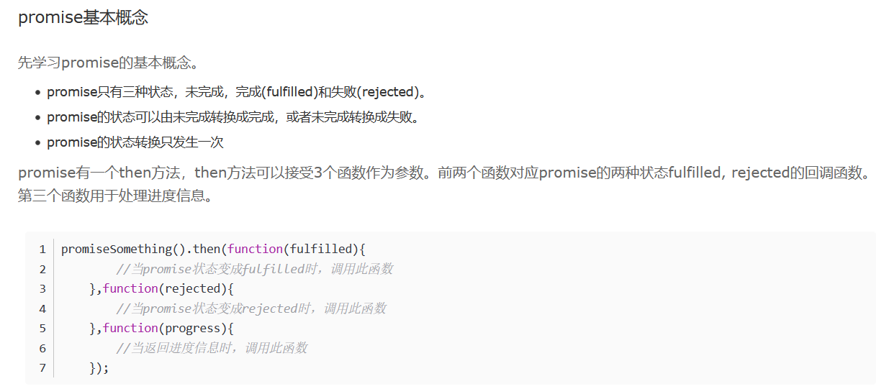

# 							期末作业中的可能一些问题的回答

[TOC]


#### **1.session与cookie的关系**

通俗来讲就是A 发送了一个请求到B 页面,此时的B 页面并不知道在次之前A发送了什么请求就会造成B回出现问题。

上面提到**解决HTTP协议自身无状态**的方式有cookie和session。二者都能记录状态，前者是将状态数据保存在客户端，后者则保存在服务端。

#### **2.seesion和cookie之间的对比***

**安全性**

- cookie将信息**保存在客户端**，如果**不进行加密**的话，无疑会暴露**一些隐私信息**，**安全性很差**，一般情况下敏感信息是经过加密后存储在cookie中，但很容易就会被窃取。
- 而session只会**将信息存储在服务端**，如果存储在文件或数据库中，也有被窃取的可能，只是可能性比cookie小了太多。

Session安全性方面比较突出的是存在会话劫持的问题，这是一种安全威胁，总体来讲，session的安全性要高于cookie。

使用到的模块：

```
const cookieSession = require('cookie-session')
//这个是一个文件上传模块
const multer = require('multer')
const path = require('path')
const fs = require('fs')
```



**3.如何实现用户验证：**

